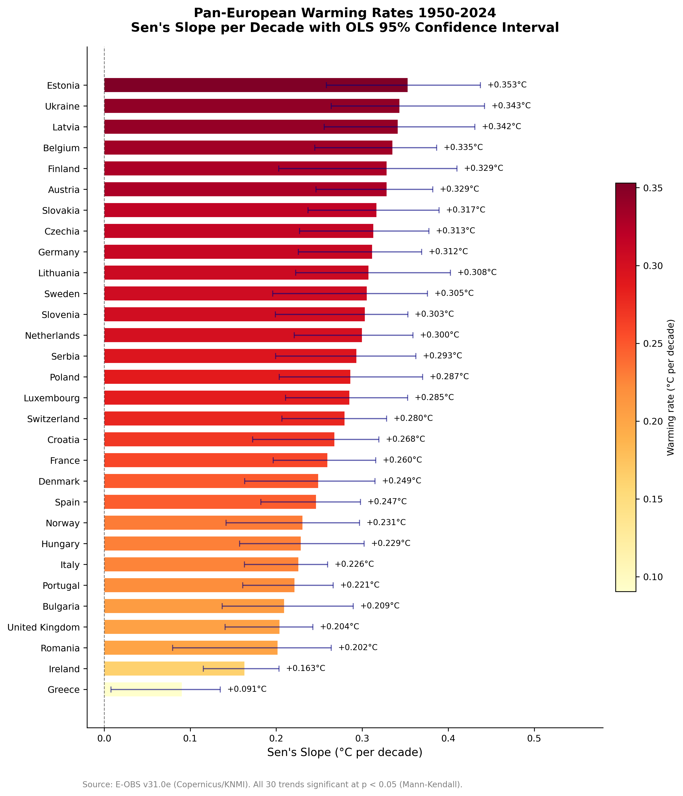
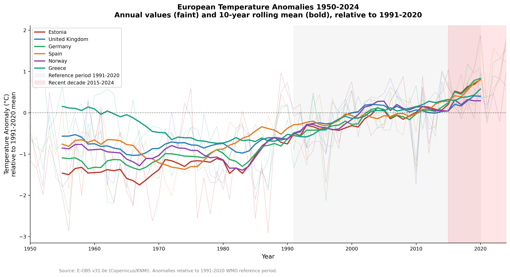
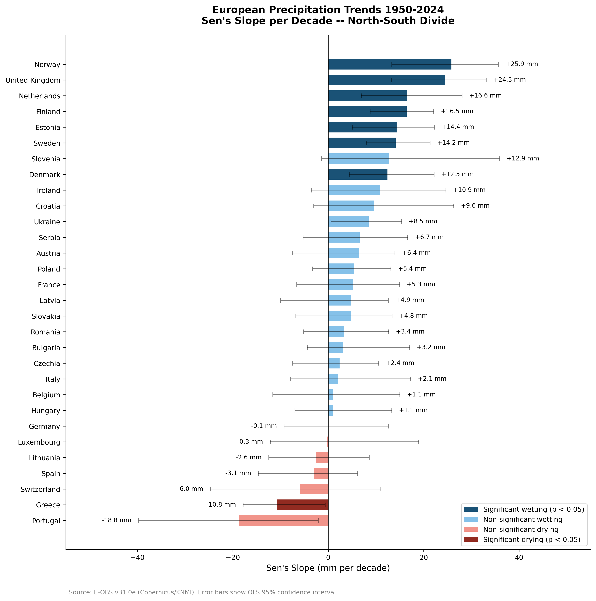
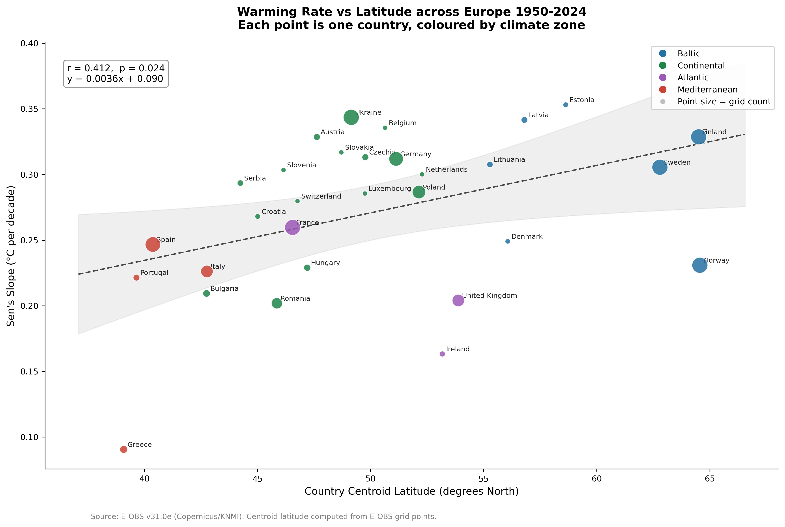
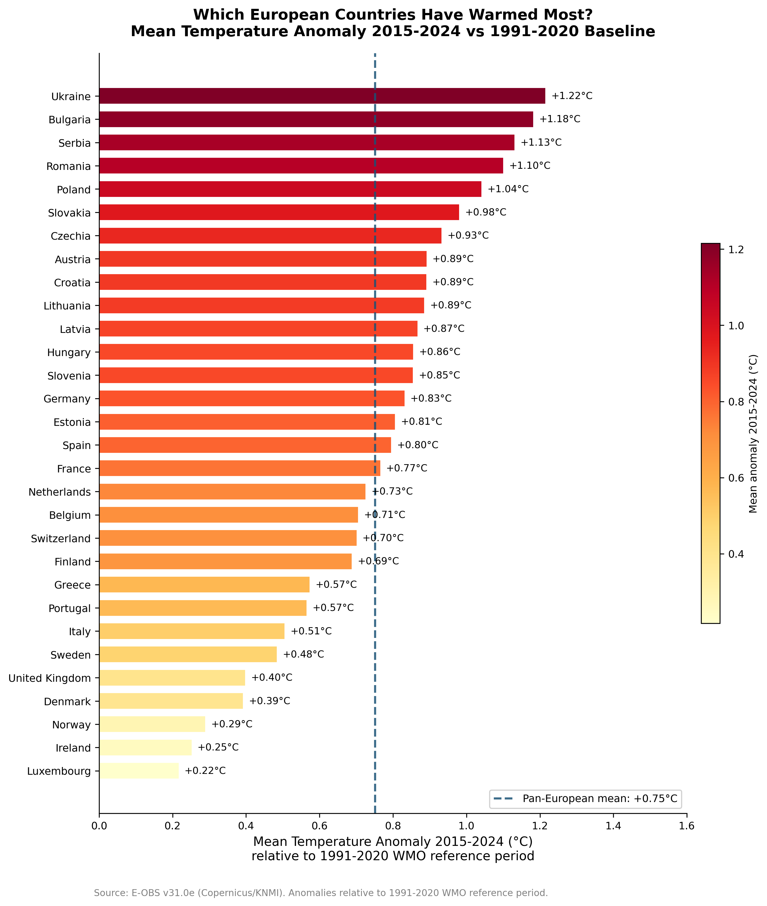

# P05 European Climate Trends 1950-2024

   

A reproducible, production-grade analysis of temperature and precipitation trends across 30 European countries using 75 years of daily observational data from E-OBS v31.0e (Copernicus/KNMI). Three complementary statistical methods -- OLS linear regression, Mann-Kendall trend test, and Sen's slope estimator -- are applied to every country and variable to ensure findings are robust to outliers, non-normality, and serial correlation.

---

## Key Findings

| Finding                          | Result                                                                                    |
| -------------------------------- | ----------------------------------------------------------------------------------------- |
| Universal warming                | All 30 countries show statistically significant warming trends at p < 0.05 (Mann-Kendall) |
| Pan-European warming rate        | +0.27°C per decade (1950-2024) -- approximately 2.0°C since 1950                          |
| Fastest warming country          | Estonia: +0.353°C per decade (Sen's slope)                                                |
| Slowest warming country          | Greece: +0.091°C per decade (Sen's slope)                                                 |
| Recent decade anomaly            | +0.751°C above the 1991-2020 WMO baseline averaged across all 30 countries (2015-2024)    |
| Most anomalous country 2015-2024 | Ukraine: +1.22°C above its own 1991-2020 baseline                                         |
| Significant wetting trends       | 7 countries -- Norway leads at +25.9 mm per decade                                        |
| Significant drying trends        | 1 country -- Greece at -10.8 mm per decade                                                |
| Latitude-warming correlation     | Pearson r = 0.412, p = 0.024 -- higher-latitude countries warm faster                     |
| Detectability asymmetry          | 30 of 30 temperature trends significant; 8 of 30 precipitation trends significant         |

---

## Visualisations

**Figure 1 -- Pan-European Warming Rates 1950-2024**



Sen's slope per decade for all 30 countries with OLS 95% confidence intervals. Every bar is positive and every trend is statistically significant. Baltic states and eastern Europe warm fastest at above 0.30°C per decade. Atlantic-influenced countries -- Ireland and the United Kingdom -- warm slowest, buffered by North Atlantic thermal inertia.

**Figure 2 -- European Temperature Anomaly Time Series**



Annual temperature anomalies and 10-year rolling means for six representative countries relative to the 1991-2020 WMO reference period. The grey band marks the reference period; the red band marks the most recent decade 2015-2024. All six countries show a consistent upward trajectory from below -1.0°C in the 1950s to above +0.5°C in the 2020s. The post-2000 acceleration is visible in every country.

**Figure 3 -- North-South Precipitation Divide**



Sen's slope per decade for precipitation across all 30 countries, coloured by direction and significance. Dark blue indicates statistically significant wetting; dark red indicates statistically significant drying. Northern and Atlantic Europe wets significantly. Greece is the only country with a statistically confirmed drying trend. Portugal shows the largest drying signal at -18.8 mm per decade but falls just short of significance at p = 0.067.

**Figure 4 -- Warming Rate vs Latitude**



Scatter plot of country centroid latitude against Sen's slope per decade, coloured by climate zone. A statistically significant positive relationship confirms that higher-latitude countries warm faster (r = 0.412, p = 0.024). Atlantic countries sit below the regression line -- buffered by the ocean. Continental eastern Europe sits above it -- amplified by land surface feedbacks. Point size is proportional to the number of E-OBS grid points within each country.

**Figure 5 -- Recent Decade Anomaly Ranking**



Mean temperature anomaly 2015-2024 relative to 1991-2020 for all 30 countries, ordered by anomaly magnitude. Five countries -- Ukraine, Bulgaria, Serbia, Romania, and Poland -- have already experienced a recent decade more than 1.0°C above their own modern baseline. The dashed blue line marks the pan-European mean of +0.751°C. Atlantic countries sit well below the mean; eastern continental Europe sits well above it.

---

## Datasets

| Dataset      | Source                               | Period    | Resolution             | Variables                                     |
| ------------ | ------------------------------------ | --------- | ---------------------- | --------------------------------------------- |
| E-OBS v31.0e | Copernicus Climate Data Store / KNMI | 1950-2024 | 0.25 degree daily grid | Mean temperature (TG), Precipitation sum (RR) |

E-OBS is a daily gridded land-only observational dataset produced by KNMI for the Copernicus Climate Change Service. It is based on meteorological station observations from National Meteorological and Hydrological Services across Europe, interpolated using kriging to a 0.25 degree regular latitude-longitude grid. E-OBS is the primary reference dataset used by the European Environment Agency and the Copernicus European State of the Climate annual reports. The dataset was downloaded programmatically via the Copernicus CDS API and is freely available at cds.climate.copernicus.eu.

---

## Methodology

The analysis pipeline proceeds in three stages across three notebooks.

**Stage 1 -- Data profiling (notebook 01).** E-OBS NetCDF files for temperature and precipitation are downloaded via the CDS API, validated as genuine HDF5-format NetCDF4 files, and opened with xarray using lazy loading to avoid loading 10 GB into RAM. Country boundaries are applied using Natural Earth v5.0.0 masks via regionmask, generating boolean grid-point masks for all 30 countries. Data is processed year by year using numpy boolean indexing to stay within memory constraints. Country-level daily means are computed by spatially averaging across all grid points inside each country boundary. Annual mean temperature and normalised annual precipitation (total precipitation divided by grid point count, in mm per year) are computed for all 30 countries across all 75 years. A data quality report assessing missing values by country and year is produced -- all 2,250 country-year combinations pass the 10% missing threshold.

**Stage 2 -- Trend analysis (notebook 02).** Temperature anomalies are computed relative to the 1991-2020 WMO standard reference period. Three statistical methods are applied to every country-variable combination. OLS linear regression estimates the trend slope with 95% confidence intervals using scipy.stats.linregress. The Mann-Kendall non-parametric trend test assesses whether a monotonic trend exists without distributional assumptions, using pymannkendall. Sen's slope estimator computes the median of all pairwise slopes as the robust trend magnitude. A finding is reported as robust when the Mann-Kendall test is significant at p < 0.05, OLS and Sen's slope agree in direction, and the OLS 95% confidence interval excludes zero. All 30 temperature trends and 8 precipitation trends meet this standard.

**Stage 3 -- Visualisation (notebook 03).** Five production figures are generated at 300 DPI using matplotlib and seaborn. Figures are designed to communicate findings to a non-technical policy audience -- a Head of Data at a government department or European climate agency should be able to identify the key message of each figure in under five seconds.

**Statistical methods in detail.** The OLS slope is derived from the normal equations: beta_1 = S_ty / S_tt where S_ty is the cross-product of mean-centred time and values, and S_tt is the sum of squared mean-centred times. The 95% confidence interval uses the t-distribution with n-2 degrees of freedom. The Mann-Kendall statistic S counts concordant minus discordant pairs across all n(n-1)/2 combinations of years; under the null hypothesis S is approximately normal with variance n(n-1)(2n+5)/18. Sen's slope is the median of all n(n-1)/2 pairwise slopes Q_ij = (y_j - y_i)/(t_j - t_i) for i < j.

---

## Project Structure

```
project05-european-climate-trends/
|-- config.py
|-- requirements.txt
|-- README.md
|-- src/
|   |-- init.py
|   |-- analysis.py
|-- notebooks/
|   |-- 01_data_profiling.ipynb
|   |-- 02_analysis.ipynb
|   |-- 03_visualisation.ipynb
|-- data/
|   |-- raw/
|   |-- processed/
|       |-- tg_annual.csv
|       |-- rr_annual.csv
|       |-- tg_anomaly.csv
|       |-- rr_anomaly.csv
|       |-- tg_quality_report.csv
|       |-- rr_quality_report.csv
|       |-- trends.csv
|       |-- trends_final.csv
|-- figures/
|   |-- 01_pan_european_warming_rates.png
|   |-- 02_temperature_anomaly_timeseries.png
|   |-- 03_precipitation_north_south_divide.png
|   |-- 04_warming_rate_vs_latitude.png
|   |-- 05_recent_decade_anomaly_ranking.png
|-- reports/
|   |-- policy_brief.md
```

---

## How to Reproduce

Clone the repository and navigate to the project folder:

```bash
git clone https://github.com/insightful-algorithms/project05-european-climate-trends.git
cd project05-european-climate-trends
```

Create and activate the virtual environment, then install dependencies:

```bash
python -m venv ds_env
ds_env\Scripts\activate
pip install -r requirements.txt
```

Register the Jupyter kernel:

```bash
python -m ipykernel install --user --name project05-climate --display-name "P05 European Climate Trends"
```

Configure the Copernicus CDS API by registering for a free account at cds.climate.copernicus.eu and creating the file `~/.cdsapirc` with your personal access token:

```
url: https://cds.climate.copernicus.eu/api
key: YOUR_PERSONAL_ACCESS_TOKEN
```

Accept the E-OBS dataset terms of use on the CDS dataset page before running notebook 01. Then run the three notebooks in order. Notebook 01 downloads approximately 1.1 GB of NetCDF data from the CDS -- download time depends on queue load and connection speed.

---

## Technologies

| Technology    | Version  | Role                                        |
| ------------- | -------- | ------------------------------------------- |
| Python        | 3.13.2   | Core language                               |
| pandas        | 3.0.2    | Tabular data processing and aggregation     |
| numpy         | 2.4.4    | Array operations and numerical computation  |
| xarray        | 2026.4.0 | NetCDF file handling and lazy loading       |
| netCDF4       | 1.7.4    | NetCDF4/HDF5 backend for xarray             |
| cdsapi        | 0.7.7    | Copernicus Climate Data Store API client    |
| regionmask    | 0.13.0   | Natural Earth country boundary masking      |
| pymannkendall | 1.4.3    | Mann-Kendall test and Sen's slope           |
| scipy         | 1.17.1   | Linear regression and statistical functions |
| statsmodels   | 0.14.6   | Statistical modelling                       |
| matplotlib    | 3.10.8   | Production figure generation                |
| seaborn       | 0.13.2   | Plot styling and colour palettes            |

---

## Author

**Ose Omokhua**  
MSc Data Science
BSc Physics
London, UK

github.com/insightful-algorithms
